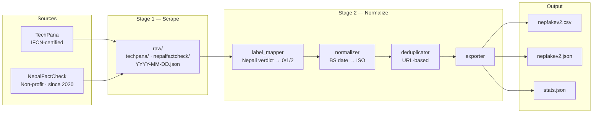

# NepFakeV2 🇳🇵

[](https://github.com/Nandansingh007/NepFakeV2/actions/workflows/weekly_scrape.yml)


---

## What Is This

NepFakeV2 is the first real, non-synthetic Nepali fact-checking dataset. It is built directly from verified fact-checks published by professional Nepali fact-checkers — not machine-translated, not LLM-generated, not GPT-generated absurdism.

All existing Nepali fake news datasets fail in one of two ways: they use machine-translated US political content (introducing topic-domain and MT-artifact confounds), or they use LLM-generated examples that do not reflect real misinformation that actually circulated in Nepal. NepFakeV2 breaks this cycle by sourcing directly from two active IFCN-adjacent Nepali fact-checkers.

The dataset grows automatically — new fact-checks are scraped, normalized, and committed to this repo every week.

---

## Getting Started

```python
import pandas as pd

df = pd.read_csv(
    "https://raw.githubusercontent.com/Nandansingh007/NepFakeV2/main/data/nepfakev2.csv"
)
print(df[["claim_text", "verdict_label", "verdict_label_text", "source_name"]].head())
```

Or clone and use locally:

```bash
git clone https://github.com/Nandansingh007/NepFakeV2.git
python -c "import json; data=json.load(open('data/nepfakev2.json')); print(len(data), 'examples')"
```

---

## Labels

| Label | Name | Description |
|-------|------|-------------|
| 0 | REAL | Verified factual — confirmed by fact-checkers |
| 1 | FALSE_MISLEADING | Debunked — false or misleading content |
| 2 | UNVERIFIED | Cannot be confirmed or denied |

> **On label imbalance:** 90%+ of examples are FALSE_MISLEADING. This reflects real-world distribution — fact-checkers publish mostly debunks by design. This is not a collection error. Researchers needing label balance should supplement with a verified news source using the provided scraper base class.

---

## Sources

| Source | Type | Language | Coverage |
|--------|------|----------|----------|
| [TechPana](https://techpana.com/factcheck/) | IFCN-certified fact-checker | Nepali | Feb 2025 → present |
| [NepalFactCheck](https://nepalfactcheck.org) | Non-profit fact-checker (CMR-Nepal) | Nepali | Mar 2020 → present |

---

## Schema

| Field | Type | Description |
|-------|------|-------------|
| `example_id` | str | Unique ID — `NF2_YYYYMMDD_NNNN` |
| `claim_text` | str | Article headline (the claim) |
| `verdict_label` | int | 0 / 1 / 2 |
| `verdict_label_text` | str | REAL / FALSE_MISLEADING / UNVERIFIED |
| `evidence_text` | str | Full fact-check article body |
| `source_name` | str | techpana / nepalfactcheck |
| `source_url` | str | Original article URL |
| `date_published` | str | ISO date YYYY-MM-DD |
| `is_native_nepali` | bool | True if Devanagari script detected |
| `topic_category` | str | politics / health / technology / society / environment / economy / other |
| `annotator_notes` | str | Edge case flags — empty if clean |
| `schema_version` | str | 1.0 |

---

## Pipeline



> GitHub Actions triggers this pipeline weekly. Only articles published since the last run are fetched. Outputs are auto-committed after every run.

---

<!-- STATS_START -->
## Dataset Statistics

| | |
|---|---|
| 🗃 Raw articles scraped | **935** |
| ✅ Normalized examples | **935** |
| 📅 Date range | 2020-03-13 → 2026-09-11 |
| 🕒 Last updated | 2026-09-22 04:56 UTC |

**Last run:** 2026-09-22 &nbsp;|&nbsp; ✓ TechPana: +0 new &nbsp;|&nbsp; ✓ NepalFactCheck: +0 new


### Label Distribution (normalized)

| Label | Count | % |
|-------|------:|--:|
| REAL                 |    61 |   6.5% |
| FALSE_MISLEADING     |   851 |  91.0% |
| UNVERIFIED           |    23 |   2.5% |
| UNKNOWN              |     0 |   0.0% |

### Source Breakdown (raw)

| Source | Articles | Verdict profile |
|--------|----------:|-----------------|
| TechPana         |  272 | भ्रामक: 57%  मिथ्या: 41%  अपुष्ट: 2%  सही: 1% |
| NepalFactCheck   |  663 | भ्रामक: 53%  मिथ्या: 35%  सही: 9%  अपुष्ट: 3% |

Nepali script coverage: **99.8%**
<!-- STATS_END -->

## Limitations

- **Label imbalance** — fact-checkers publish mostly debunks by design. 90%+ of examples are FALSE_MISLEADING. This reflects real-world distribution, not a collection error.
- **claim_text is the article headline** — not an atomically extracted claim. Future versions will improve atomic claim extraction.
- **Cross-source duplicates** — the same claim may be fact-checked independently by both sources. Both records are retained as independent verifications. Cross-source deduplication requires Nepali NER and is documented as future work.
- **TechPana uses Cloudflare** — TechPana blocks datacenter IPs. Scraped via FlareSolverr Docker in CI. See `.github/workflows/weekly_scrape.yml`.

---

## Citation

```bibtex
@dataset{singh2026nepfakev2,
  author    = {Singh, Nandan},
  title     = {NepFakeV2: A Live auto-updating Dataset for Nepali Misinformation Detection},
  year      = {2026},
  publisher = {GitHub},
  url       = {https://github.com/Nandansingh007/NepFakeV2},
  note      = {Schema v1.0. Auto-updated weekly.}
}
```

---

## License

- **Data** (`data/`): [CC BY 4.0](https://creativecommons.org/licenses/by/4.0/)
- **Code**: [MIT](LICENSE)

---

*Built by [Nandan Singh](https://github.com/Nandansingh007) · 2026*