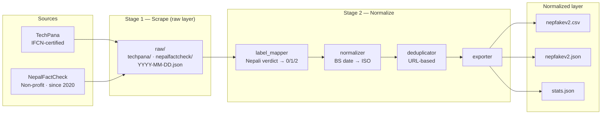

# NepFakeV2 🇳🇵

[](https://github.com/Nandansingh007/NepFakeV2/actions/workflows/weekly_scrape.yml)


**Live, auto-updating data infrastructure for Nepali fact-checking and misinformation research.**

---

## What Is This

NepFakeV2 is primarily a **data collection infrastructure for researchers**. It continuously collects fact-checks published by professional Nepali fact-checkers and exposes them in two layers:

- **Raw layer (`raw/`)** — fact-checks preserved exactly as scraped, stored separately by source and collection date (`raw/<source>/YYYY-MM-DD.json`). Nothing is relabelled, merged, or dropped. Use this layer to apply your own cleaning, deduplication, annotation, or modelling approach.
- **Normalized layer (`data/`)** — a convenient, research-ready representation: verdicts mapped to a shared label set, Bikram Sambat dates converted to ISO, and every record in one consistent schema.

Every record is real, human-verified content that circulated in Nepal — not machine-translated from English-language datasets and not LLM-generated. Publicly available Nepali fake-news datasets typically rely on one of those two shortcuts, which introduce topic-domain and translation-artifact confounds or fail to reflect the misinformation Nepali audiences actually encounter.

New fact-checks are scraped, normalized, and committed to this repo automatically every week.

---

## Getting Started

**Normalized dataset:**

```python
import pandas as pd

df = pd.read_csv(
    "https://raw.githubusercontent.com/Nandansingh007/NepFakeV2/main/data/nepfakev2.csv"
)
print(df[["claim_text", "verdict_label", "verdict_label_text", "source_name"]].head())
```

Also available on Hugging Face: [`Nandan007/NepFakeV2`](https://huggingface.co/datasets/Nandan007/NepFakeV2) (normalized layer only).

**Raw layer** (clone the repo — raw files are published on GitHub only):

```bash
git clone https://github.com/Nandansingh007/NepFakeV2.git
cd NepFakeV2
```

```python
import json, glob
import pandas as pd

rows = []
for path in sorted(glob.glob("raw/*/*.json")):
    if path.endswith("stats_raw.json"):
        continue
    source, collected = path.split("/")[-2], path.split("/")[-1][:-5]
    for rec in json.load(open(path, encoding="utf-8")):
        rows.append({**rec, "_source": source, "_collected_on": collected})

raw = pd.DataFrame(rows)
print(raw.columns.tolist())
print(raw["raw_verdict_text"].value_counts())
```

Raw verdicts are kept in the original Nepali (e.g. भ्रामक, मिथ्या, सही, अपुष्ट) so you can define your own label mapping.

---

## Labels (normalized layer)

| Label | Name | Description |
|-------|------|-------------|
| 0 | REAL | Verified factual — confirmed by fact-checkers |
| 1 | FALSE_MISLEADING | Debunked — false or misleading content |
| 2 | UNVERIFIED | Cannot be confirmed or denied |

See [Limitations](#limitations) on label imbalance.

---

## Sources

| Source | Type | Language | Coverage |
|--------|------|----------|----------|
| [TechPana](https://techpana.com/factcheck/) | IFCN-certified fact-checker | Nepali | Feb 2025 → present |
| [NepalFactCheck](https://nepalfactcheck.org) | Non-profit fact-checker run by CMR-Nepal (not IFCN-certified) | Nepali | Mar 2020 → present |

---

## Schema (normalized layer)

| Field | Type | Description |
|-------|------|-------------|
| `example_id` | str | Unique ID — `NF2_YYYYMMDD_NNNN` |
| `claim_text` | str | Article headline (the claim) |
| `verdict_label` | int | 0 / 1 / 2 |
| `verdict_label_text` | str | REAL / FALSE_MISLEADING / UNVERIFIED |
| `evidence_text` | str | Full fact-check article body |
| `source_name` | str | techpana / nepalfactcheck |
| `source_url` | str | Original article URL |
| `date_published` | str | ISO date YYYY-MM-DD |
| `is_native_nepali` | bool | True if Devanagari script detected |
| `topic_category` | str | politics / health / technology / society / environment / economy / other |
| `annotator_notes` | str | Edge case flags — empty if clean |
| `schema_version` | str | 1.0 |

---

## Pipeline



> GitHub Actions runs this pipeline weekly. Only articles published since the last run are fetched. Outputs are auto-committed to this repo and pushed to Hugging Face after every run.

---

<!-- STATS_START -->
## Dataset Statistics

| | |
|---|---|
| 🗃 Raw articles scraped | **941** |
| ✅ Normalized examples | **941** |
| 📅 Date range | 2020-03-13 → 2026-09-22 |
| 🕒 Last updated | 2026-09-23 06:57 UTC |

**Last run:** 2026-09-23 &nbsp;|&nbsp; ✓ TechPana: +0 new &nbsp;|&nbsp; ✓ NepalFactCheck: +6 new


### Label Distribution (normalized)

| Label | Count | % |
|-------|------:|--:|
| REAL                 |    62 |   6.6% |
| FALSE_MISLEADING     |   856 |  91.0% |
| UNVERIFIED           |    23 |   2.4% |
| UNKNOWN              |     0 |   0.0% |

### Source Breakdown (raw)

| Source | Articles | Verdict profile |
|--------|----------:|-----------------|
| TechPana         |  272 | भ्रामक: 57%  मिथ्या: 41%  अपुष्ट: 2%  सही: 1% |
| NepalFactCheck   |  669 | भ्रामक: 53%  मिथ्या: 35%  सही: 9%  अपुष्ट: 3% |

Nepali script coverage: **99.8%**
<!-- STATS_END -->

## Limitations

- **Label imbalance** — fact-checkers publish mostly debunks by design, so 90%+ of normalized examples are FALSE_MISLEADING. This reflects the source distribution, not a collection error. Researchers needing label balance can supplement with a verified news source using the provided scraper base class.
- **`claim_text` is the article headline** — not an atomically extracted claim.
- **Cross-source duplicates are kept intentionally** — the same claim may be fact-checked independently by both sources. These records are preserved as separate observations with their original provenance, since they represent independent verifications. Deduplication in the pipeline is URL-based only; claim-level deduplication or clustering can be performed as a downstream task.
- **TechPana uses Cloudflare** — TechPana blocks datacenter IPs and is scraped via FlareSolverr in CI. See `.github/workflows/weekly_scrape.yml`.

---

## Citation

```bibtex
@dataset{singh2026nepfakev2,
  author    = {Singh, Nandan},
  title     = {NepFakeV2: Live Auto-Updating Data Infrastructure for Nepali Fact-Checking and Misinformation Research},
  year      = {2026},
  publisher = {GitHub},
  url       = {https://github.com/Nandansingh007/NepFakeV2},
  note      = {Schema v1.0. Auto-updated weekly. Cite the collection date of the snapshot you used.}
}
```

---

## License

- **Data** (`data/`, `raw/`): [CC BY 4.0](https://creativecommons.org/licenses/by/4.0/)
- **Code**: [MIT](LICENSE)

---

*Built by [Nandan Singh](https://github.com/Nandansingh007) · 2026*